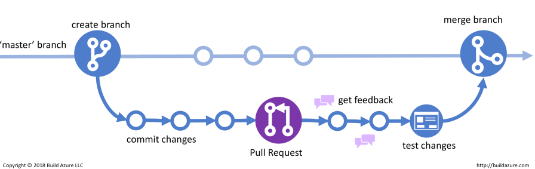

# Benjamin Davies Workbook A

## Question 1

### _Describe the architecture of a typical Flask application_

    Flask is a backend framework built for Python, flask is great for small applications but doesn’t scale well. As your your project becomes larger and you require more routes / views it will become more difficult to maintain your code. When your application grows in size or complexity, you may want to structure your code differently to keep it clear and understandable, this is where frameworks like Django are more suited to your application. Flask allows you to write flexible and concise code, there's no set way to structure your code you can choose the way that it is structured. 

    In a simple flask application the first step to is creating a Flask object (app = Flask), then you can define your routes using the decorator ('@'). Flask will then handle the incoming HTTP requests and direct the request to the appropriate route, inside a flask route a view can be defined. A view in flask is typically a function that is called when the flask hits that route, inside a view any number of operations can be performed before flask will return the intended data back to the user. flask has builtin functionality were by default will convert the data to JSON for us.

    Flask makes use of a module called Blueprints, blueprints allow you to arrange your code into separate files to keep it more organized and maintainable, blueprints can store multiple routes, templates and views. Flask is also very flexible with database connections, integrating a database is simple and flask supports a large range of popular databases including PostgreSQL, MySQL, SQLite, Oracle and Microsoft SQ. Unlike the Django framework flask doesn't come with a built-in ORM language to query or manipute databases, but supports a large range of third-party ORM's that allow for easy database manipulation, SQLAlchemy is the most widely used and best suited to all flask application types.

## Question 2

### _Identify a database management system (DBMS) commonly used in web applications (including Flask) and discuss the pros and cons of this database_

    A DBMS's primary function is the storage of data, there are many DBMS Hosts to choose from and they all have strenghts and weaknesses. One of the largest DBMS is called Oracle, oracle was built in the 1977 by Larry Ellison and bob miner it's still today one of the most robust, powerful and widely used database systems in the world. Oracle supports semi-structured data (JSON), it has robust security features to protect data and recovery lost data. Oracle is performance driven and is scalable for any size of business, with that said oracle is not free to use and is complex to both setup and manage, oracle at its core was designed to be a relational database, it does have a version of NoSql with oracle NoSql but is not preferrable over other choices such as MongoDB if your project required a NoSql database. 

    One good relational database alternative to Oracle that pairs very well with flask applications is Postgres. Postgres is a free open source DBMS system, it supports a large range of advanced data types including semi-structured data such as (JSON), arrays and key/value pairs. It's free to use, scalable and has a larger support network maintaining it, Postgres also supports all operating systems so can be used with Windows, Linux, Mac and others. Some negetives of postgres include, It doesn't come with as many features straight out of the box so importing modules like psycogy for python developers is essential and a ORM to query or modify the database. Postgres also tends to be more server heavy than others like MySQL resulting in slower query times but postgres does make up for this by being more capable at processing complex queries and querying large datasets. 

## __Question 3__

### _Discuss the implementation of Agile project management methodology_

    Agile requires a willingness from all parties to work, management and devs need to adapt an agile system so it may succeed. Agile has a strong focus on user stories and the user's end experience, it does this by getting the developers to answer the following sentence when planning a feature or branch, "As a who', I 'want to', so 'that why'". By looking at the application from different perspectives developers can gain greater insight into how an application or feature should function. Agile also promotes a strong client involvement leading to faster production times and generally a greater understanding of the application requirements. The benefits of choosing an agile system for a project include:
            
            1. Increased Skateholder involvement, allowing for a clear and direct path to meet the client's application needs. 
            2. Greater Team comradery and improved team support and morale.
            3. Faster application delivery teams work on small parts of an application at a time instead of the entire thing.
            4. Improved risk management and ability to identify potential problems in the application earlier.

    An (APM) system is best suited to projects that have an unknown or open-ended amount of requirements/features this also includes projects whose plan is likely to change frequently. One common Agile project management framework in software development is called (scrum). Scrum utilizes a fixed length of work, these are called sprints. Each sprint contains 4 parts.

            1. Sprint Planning, A meeting among the team to determine what should be completed in the upcoming sprint.
            2. Demonstration, A chance to show other team members what they've completed in that sprint.
            3. Daily Standup, A chance for the teams to collaborate.
            4. Review, A review of the sprint, to see what went well and what can be improved.

    Another Agile framework called kanban is different as instead of sprints it uses "Work In Progress limits" or "WIP" for short, Kanban has a continuous stream of tasks or cards that should be completed. The amount of work to be completed depends on the size of the team and is determined before production starts. Kanban is typically faster than Scrum and offers the ability to react faster to application changes.

## __Question 4__

### _Provide an overview and description of a standard source control workflow_

    Project source control is crucial when planning a project, good source control will allow developers to maintain backups, keep a history, view changes, experiment with features, and collaborate on projects. There are two types of source control repositories they are centralized repositories or distributed repositories.
    
        - A centralized repository is a single server that holds all of the data on the project.
        - A distributed repository is where each developer clones the repository to their computer. 
    
    While Version control doesn't affect our workflow it's important to understand where our data is being stored. The most common distributed repository at the moment is Github others include BitBucket and SourceForge. A complex Web Application is made up of many different components, when developing an application we break it into more manageable pieces these are called features. This is great in principle but problems can arise when we have more than one developer or team working on an application. If we have more than one feature that shares the same module of code then we need to be careful when commit our changes, Pre-existing features or features that are in development may depend on this module. This is why repositories provide us with information about the changes to our code. 

    In modern-day programming, the main branch of the project sometimes referred to as the trunk is created at the beginning development phase. Then branches are formed for each feature of the application, by creating features separate from the main source control we can properly test and review our code before making changes to the application. Once the testing and review phase is complete we will merge the code into the main and the application will have gained a new version. Features can be created before or after deployment of the application. The stages of source control workflow can be defined in order:

        1. Create a new branch for the intended feature
        2. Develop the new feature
        3. Commit changes to branch
        4. Create a pull request
        5. Review and test new feature with the team lead
        6. Client Review
        6. Merge the new feature into the main  
    
    The image below illustrates how we would add a new feature to an application. 

## __Question 5__

### _Provide an overview and description of a standard software testing process (e.g. manual testing)_

    A critical part of developing web applications is testing, when we test an application we aren't necessarily looking for syntax errors or bugs in our code but rather the structure of the application. We can break an application into different categories and then ask ourselves the following questions about our application:

        1. Functionality - does the website do what we want it to?
        2. Useability - is the easy to use and appeals to the client/customers?
        3. Application Interface - does the application talk to the web server and database correctly and handle errors?
        4. Compatability - what browsers/devices is it compatible with?
        5. Performance - how does it perform with search engines are the load speeds within a reasonable timeframe?
        6. Security - is our stored data secure?

    Manual testing is one type of software testing we can conduct, it consists of first understanding what the desired output should be from the application, then creating a plan to test the application, executing the test, recording the results of the test, and then updating or modifying the application if required. This process can be repeated as many times are necessary until the application's desired output is reached. An example of how we can test an application's Interface is checking for errors or inconsistencies between the application web server and the database. This process is sometimes referred to as Workflow testing or end-to-end (E2E) testing. The goal of E2E testing is to make an HTTP request to the web server and then the web server will perform an action or query depending upon the request and then return something to the user. An example of E2E testing is checking if a flask route is returning the correct view. To test this we would have to

            1. Make an HTTP POST request to the web server with the intended route
            2. Our flask object will then run our code to check for our route
            3. After that the web server will return the view of the route to the user

    A coding example of this is shown below.

## Question 6

### _Discuss and analyse requirements related to information system security and how they relate to the project_

    System security is a critical aspect of any project, it includes the protection, confidentiality, integrity, and availability of information. The requirements related to information system security are essential to make sure that the project data is secure and mitigates potential risks. Key aspects to consider when discussing and analyzing information system security requirements include:

        1. Risk assessments and code reviews
        2. Defining the Access Control
        3. Database encryption
        4. Tracking suspicious activity
        5. Security breach response plans

    Identifying security risks before they can be exploited is the goal of any application and is the main focus of every application and feature we design. Access Control is important for defining who can access what data and allows us to control sensitive data. database encryption or hashing is the standard for all databases that hold users sensitive data such as passwords and personal information. Tracking the servers activity and logging suspicious users is another we protect users information. Having a well-defined plan for a cyber attack or data leak will ensure a fast response and reduce damage to the application or business. No system is completely secure but implementing these into the project it will greatly mitigate the risk of the cyber attack and the potential compromise of data.

## Question 7

### _Discuss common methods of protecting information and data and how you would apply them to the project_

    Common Methods that we apply to protect users information and data include:

        1. Data hashing 
            - A one way hashing of data, commonly used for passwords so that they cannot be changed back to there original format. 
        2. Data encryption
            - A two way encryption of data, commonly used in banking allows us to encrypt bank data so we can verify transations at a later stage.
        3. Multi-factor authentication
            - Asking all users / administators to provide two or more pieces of identification to identify themselves.
        4. Access Controls
            - Access control methodology making it hard for people to access application endpoints that contain access to sensitive data.
        5. Data backups
            - Having a copy of users data to provide data integrity. 

    Sensitve Data will be stored in a hashed or encrypted format so that even if someone was to access the database they couldn't easily use the information that they stealing. We will offer users the option to use multi-factor authentication as this is one of the best ways to manage access control. We will backup users data to another server so that if information is lost, destroyed or our main server is compromised we can be replace users login credientals or other senstive data quickly and without disconviencing the user.  

## Question 8

### _Research what your legal obligations are in relation to handling user data and how they can be met for the project_

    The mandatory requirements for handling users data is set out in schedule 1 of the Privacy Act 1988, these are then summarized into thirteen Privacy Principles called (APP). One legal obligations that business or entities must adhere one is providing users with a privacy policy. The privacy policy must be easily accessable for users and must disclose the following:

        1. The kinds of information that they entity collects.
        2. How the information is collected.
        3. The purpose for which it is being stored.
        4. How an individual many access personal information should it need to be alter or corrected.
        5. How an individual many complain about a breach of personal data.
        6. Whether the entity is likely to disclose informaiton to overseas reciepents.

    Another legal obligation is the security of personal information, if an business holds personal information, they must take such steps as are reasonable in the circumstances to protect the information:
        
        1. from misuse, interference and loss
        2. from unauthorised access, modification or disclosure.

    Also if the business holds personal information about an individual and no longer needs the information for any purpose for which the information may be used or disclosed by the business, They must take reasonable steps to destroy the information or to ensure that the information is de‑identified.

## Question 9

### _Describe the structural aspects of the relational database model. Your description should include information about the structure in which data is stored and how relations are represented in that structure_

    Relational databases consist of interjoining these tables, each table can consist of many columns to hold specific data. To query or search data effectively we need to be able to identify it this is why each table is given A Primary key and foriegn key. Primary keys are used to sort data and must be unique for each piece of information (id's are commonly used as they are always unique), foreign keys can also be used to sort data but by convention are not used as the foriegn keys can contain duiplictions of data. Tables may consist of no foriegn keys or many foriegn depending upon its relationship to other tables, foriegn keys by contention will always be a Primary key in another table. This is how tables in a relational databases are formed.
    
    The relationships of the tables can be described as either "one-to-one", "one-to-many" or "many-to-many", with this in mind we can determine which Column or table data will be the best for our Primary key and what data can be broken down into its own table using a foriegn key. Typically a "one-to-one" and "one-to-many" relationship will only require one foriegn key while "many-to-many" relations will require 2 or more foriegn keys.

    The diagram below shows how relationships of a simple class or lesson application database can be defined. When data to structured like this it become easy to query, sort and search. 

## Question 10

### _Describe the integrity aspects of the relational database model. Your description should include information about the types of data integrity and how they can be enforced in a relational database_

    database integrity are the rules that we set when designing our database, integrity refers to the accuracy, consistency and completeness of our data. By defining data integrity it can protects against data loss and data leaks. Maintaining the integrity of your data over time is crutial as our database scales up and will affect our servers respone times to database operations. 
        
        1. Entity Integrity 
            This encompasses how we use determine primary keys, making sure that we use unique primary keys that we can quickly identify our data with. id's are typically a good as they are always unique.

        2. Referential Integrity
            The relationship between tables is consistant and that foriegn keys are a primary key in there own table. i.e foriegn key values need to match a primary key values in there own table.

        3. Domain Integrity
            The integrity of values in the sense that when we create our data we are storing it in the appropiate data type i.e string, integer, boolean.

        4. User-defined Integrity
            Making sure that users are entering complete and accurate data for example customers providing both a first and last or that a customer resides in a certain country to use before storing data in the database.

## Question 11

    Describe the manipulative aspects of the relational database model. Your description should include information about the ways in which data is manipulated (added, removed, changed, and retrieved) in a relational database.

## Question 12

    Conduct research into a web application (app) and answer the following parts:  a. List and describe the software used by the app.
        b. Describe the hardware used to host the app.
        c. Describe the interaction of technologies within the app
        d. Describe the way data is structured within the app
        e. Identify entities which must be tracked by the app
        f. Identify the relationships and associations between the entities you have identified in part (e)
        g. Design a schema using an Entity Relationship Diagram (ERD) appropriate for the database of this website (assuming a relational database model)

## Resources
https://www.qlik.com/us/data-management/data-integrity#:~:text=Within%20logical%20integrity%2C%20there%20are,use%20to%20ensure%20accurate%20data